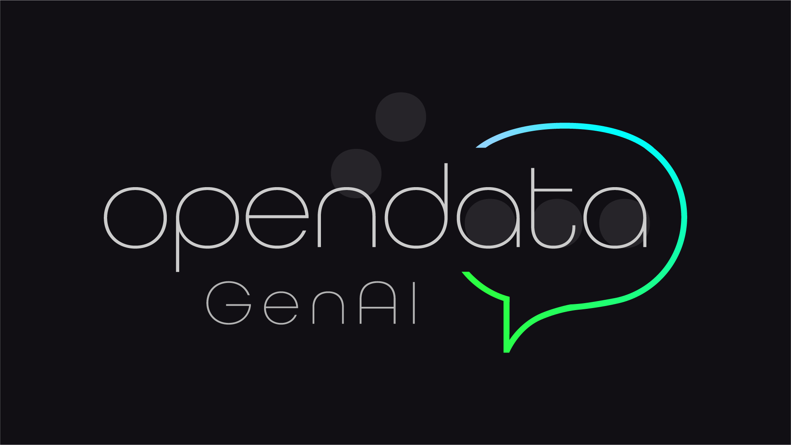

# Open Data GenAI Bot



## Work in Progress

Project developed as the Final Degree Project in Information Technology Engineering at UNED. Please don't use in production.

## Install instructions

### Install dependencies

```shell
virtualenv venv
source venv/bin/activate
pip install -r requirements.txt
```

Then, add spaCy es_core_news_md model

```shell
python -m spacy download es_core_news_md
```

### Create configuration file

You'll need:

- Telegram Bot name and API token
- DKAN API url
- OpenAI API key
- AWS S3 bucket
- MongoDB connection URI

```shell
cp .env.example .env
vi .env
```

## Run servers

### Run NLU Core Server

```shell
rasa run
```

### Run Rasa SDK Action Server

```shell
rasa run actions
```

### ngrok for local development

You can use your local Telegram webhook with ngrok.

```shell
ngrok http 5005
```

---

[](./images/UNED_logo.jpg)
